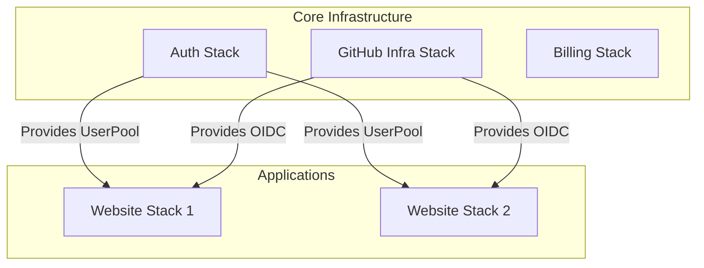

# Architecture Overview

The `blueprint_infra` project is an AWS CDK application that provisions a scalable, serverless foundation for multiple applications.

## High-Level Architecture

The infrastructure is composed of several independent but related Stacks.

## Stack Descriptions

### 1. Auth Stack (`blueprint-auth-stack`)
- **Purpose:** Centralized Identity Management.
- **Resources:**
    - Amazon Cognito User Pool
    - User Pool Domain
- **Usage:** Provides authentication services for all websites that require `requiresAuth: true`.

### 2. GitHub Infra Stack (`blueprint-github-stack`)
- **Purpose:** CI/CD Integration and Productivity Tools.
- **Resources:**
    - OIDC Provider for GitHub Actions.
    - IAM Roles allowing GitHub Actions to deploy to this AWS account.
    - **Pull Request Reminder System:** A scheduled Lambda function that checks for stale PRs and sends reminders. (Requires `buddy-bot/github-token` secret).
- **Usage:** Enables secure, keyless deployment from GitHub Actions pipelines and helps keep code reviews moving.

### 3. Billing Stack (`blueprint-billing-stack`)
- **Purpose:** Cost Monitoring.
- **Resources:**
    - Cost anomaly detection.
    - Scheduled reports via AWS SES.
- **Usage:** Sends daily/weekly billing reports to the configured `RECIPIENT_EMAILS`.

### 4. Website Stacks (`blueprint-<name>-website-stack`)
- **Purpose:** Individual Application Hosting.
- **Resources:**
    - Amazon S3 (Static assets)
    - Amazon CloudFront (CDN)
    - Lambda@Edge (Security headers, Auth checks)
    - Route53 Records (Subdomain routing)
- **Configuration:** Dynamically generated based on the `WEBSITES` environment variable.
- **Special Cases:**
    - If `name` is set to `"vault"`, the stack also provisions the **Password Vault Backend** (DynamoDB + Lambda + API Gateway) for the Password Manager application.
- **Features:**
    - Can be public or protected behind Cognito Auth.
    - Deployed from a specific GitHub repository/branch.

## Cross-Stack Dependencies

- **Websites depend on Auth:** If a website requires authentication, it imports the User Pool ID from the Auth Stack.
- **Websites depend on GitHub Infra:** Websites create specific IAM roles for their CI/CD pipelines, which rely on the OIDC provider set up in the GitHub Infra Stack.
